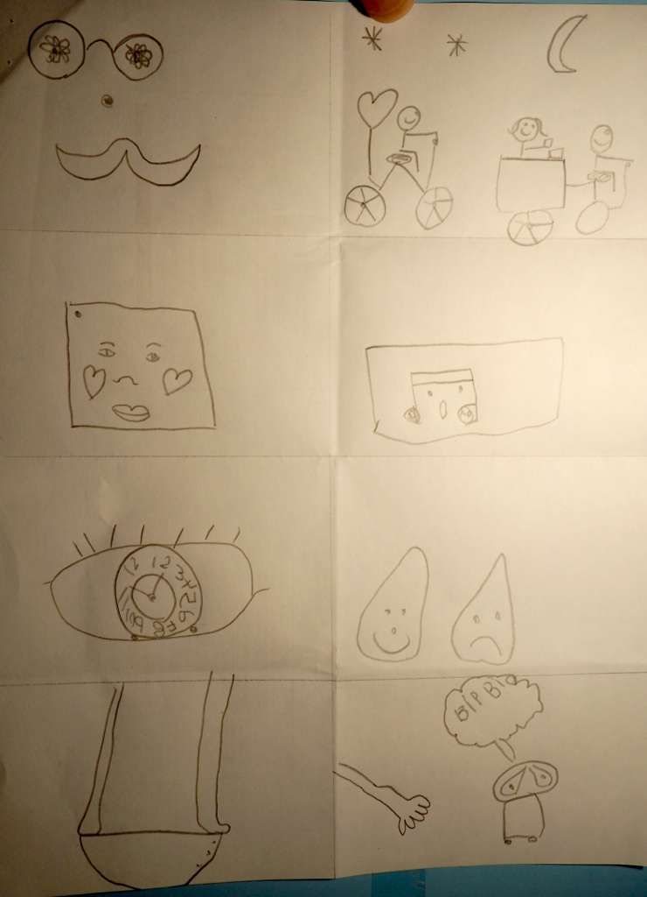

# Ordre du jour pour la recontre du dimanche 11 septembre 2016
 
 - Sébastien Cabot
 - Pascal Prado
 - André Mallette

## Participation des enfants.

Mathilde aimerait présenter un projet puisque que son métier plus tard sera présentatrice (c'est ce qu'elle me dit).

- Déléguer la production des dessins, logo, schéma, titres aux enfants.
- Le setup WiFi avec lumière serait le projet partagé avec les enfants.
- Les enfants doivent pratiquer leur présentation avant l'événement. (sans/avec publique)

  
## Site web

- Enregistrer un domaine.
- Page de présentation de l'équipe avec logo du kiosque
- Contenu bilingue (anglais/français)
- Une page par projet
  - Une vidéo explicative par projet
  - Un logo par projet

## À collectionner

- Page de présentation:
  -  Simple feuille 8 1/2 x 11
  -  Présentation de l'équipe + tous les projets (concepteur, lien web, etc.)
  -  Recto/Verso, français/anglais
- Carte d'affaire
- Macaron
  
## Kiosque:

  - Grand Logo «Inventors Dads»
  - Structure support pour panneaux explicatifs (en coroplast)
  - Intégration de la bande DEL du line Wobbler
  - Indentifier les zones interactives du kiosque.
    - Balancuino: Le bascule, pour jouer
    - Lumivelo(retro-fit à porter):
    - Utilisation de la boite magique
    - Cuscuion, 2 chaises, une à essayer + une avec coupe pour principe.
  - Identifier l'emplacement des videos(écrans)
    - planifier cablage électrique (écran, portables, chargeurs)

  - Est-ce qu'un ex-hPetit espace pour un rappel du miroir magique

## Projet: Lumivelo

  - Présenter une ou deux structure: arc-en-ciel, le coeur
  - Présenter la boîte magique
  - Présenter le projet en photo
  - Expliquer les buts et les choses apprises
  - Réutilisation de la présentation PowerPoint ?

## Projet: Lumivélo retro-fit

  - FIX: Auto-connect impécable
  - Inventaire du matériel (bande DEL et module)
  - Décider de la structure support: Chandail, casque ou autres
  - Idée de base(déja dispo), boîte lumineuse qui contrôle la lumière
  - Idées complémentaire (à décider)
    - Ajout d'un buzzer
    - Buzzer et lumière qui change en fonction de la proximité

## Projet: Pitune:

  - Construction du circuite électronique
  - Trouver un contenant

## Projet: Sabluino

  - Présentation des programmes

## Projet: Balancino

  - Construction du module balanceur (bois)
  - Déterminer cablé ou sans fil
  - Programmation de la rétroaction (adapter code pour le jeu)

## Projet: Télécommander votre papa (EXTRA: surtout pour partager l'idée)

  - Des lunettes qui chache la vue. Une led RGB dans chaque lentille.
  - L'enfant contrôle la couleur dans chaque lentille pour donner des instructions à son papa.
  - Dans une zone de 4m x 4m, les 4 papas doivents attraper 3 objets placés au sol or sur un socle.

## Logo:

  - Produire un logo pour chaque projet

## Logistique

  - Départ vendredi soir 14 octobre
    - Je prévois prendre une journée de congé
    - Une voiture devrait suffire pour transporter tout le matériel.
    - On install tout vendredi soir à Ottawa
  - Nos familles arrivent samedi et repartent dimanche après-midi
  - Nous on remballer dimanche soir.
  - On couche à l'hotel samedi soir avec les enfants.
    - Déjeuner
    - Piscine(baignade)
  - Préparation d'une boîte à outils avec matériel de secour.

## Matériel
  - Inclure avec les piles des chargeur pour recharger en continue.
  - Avons nous assez de bandes DEL ? Faire l'inventaire.
  - Décompte des setups ESP
  - Test avec buzzer
